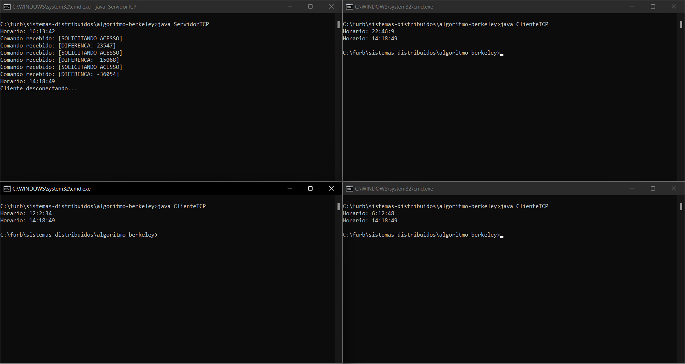

# Exemplo de sincronização de relógios utilizando socket TCP e algoritmo de Berkeley

## Introdução
O servidor aguarda durante 30s a conexão de clientes.
Durante a conexão o servidor envia seu horário para os clientes conectados, que retornam a diferença do horário deles com o do servidor.
No final dos 30s um timer previamente programado dispara e é feita a média da diferença dos horários.
Por fim o servidor retorna para os clientes o horário atualizado e atualiza seu próprio horário.

## Execução (utilizando CMD)
A porta do servidor está fixa como 90 e o cliente busca sempre pelo endereço localhost.


### Passos
- Compilar arquivos
```
javac *.java
```
- Executar servidor
```
java ServidorTCP
```
- Abrir outro CMD e executar cliente (para mais clientes repetir esse passo)
```
java ClienteTCP
```

## Preview

